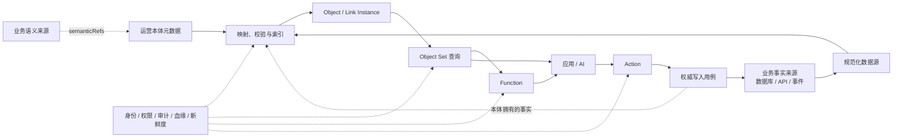

# 运营本体实践指南（基于 Palantir 方法）

> 目标：指导团队在自己的项目中建设可查询、可解释、可受控操作的运营本体。
>
> 适用读者：业务架构师、领域专家、应用工程师、数据工程师和 AI 工程师。

## 1. 建设目标

[Palantir Ontology](https://www.palantir.com/docs/foundry/ontology/overview) 将本体定位为组织的运营层和数字孪生：用 Object、Property、Link 表达业务世界，用 Function、Action 和动态安全承载判断与改变。

本指南提炼其中与产品无关的方法：

```text
运营本体
= 稳定业务语义
+ 当前对象与关系实例
+ 可组合查询
+ 确定性业务判断
+ 受控业务动作
+ 身份、权限、审计、血缘和数据新鲜度
```

完成后，项目应能：

1. 用业务对象和关系表达当前运行状态，而不是向使用者暴露表和接口细节。
2. 组合已有对象图回答建设时未预设的问题。
3. 用确定性 Function 返回结论、原因和证据。
4. 用 Action 执行业务意图，并遵守权限、条件、幂等和审计要求。
5. 让人和 AI 使用同一套语义、数据与操作边界。

本指南不要求购买或复刻 Palantir，也不规定数据库、同步框架、编程语言或部署拓扑。

## 2. 先区分四层

| 层 | 职责 | 不能替代 |
|---|---|---|
| 业务语义来源 | 定义概念、规则、流程、事件和状态 | 运行数据存储 |
| 业务事实来源 | 对业务状态拥有最终写入权 | 业务词典 |
| 运营本体元数据 | 定义 Object Type、Property、Link Type、Function 和 Action | 第二套业务语言 |
| 运营对象实例 | 保存可查询的 Object/Link 运行投影 | 未经声明的第二事实来源 |

如果项目没有业务本体，先为当前纵向切片建立最小语义目录，至少记录：

- 概念名称、定义和稳定标识；
- 规则的条件与结果；
- 流程、事件和状态转换；
- 同义词与禁用表达；
- 负责人和变更流程。

运营元数据通过 `semanticRefs` 或等价标识引用语义目录，不能重新定义业务含义。

### 2.1 明确事实所有权

逐项声明谁能写每个事实：

| 模式 | 适用场景 | Action 写入位置 |
|---|---|---|
| 源系统拥有 | 已有 ERP、CRM、交易、工单等业务系统 | 调用源系统应用用例，再同步对象投影 |
| 本体拥有 | 新建的本体原生应用，运营对象就是事实载体 | 通过受控 Action 写入本体支持的编辑层 |
| 分项拥有 | 主业务字段来自源系统，运营批注或决策记录由本体拥有 | 按字段所有权分别写入 |

同一事实只能有一个权威写入者。若多个来源可写同一属性，必须先定义优先级、冲突检测和合并规则。

## 3. 参考架构



Palantir 使用 Ontology Metadata Service、Object Data Funnel、Object Storage、Object Set Service、Functions 和 Actions 等组件承担这些职责。其他项目可以使用不同实现，但不应混合职责。[Ontology backend architecture](https://www.palantir.com/docs/foundry/object-backend/overview)

## 4. 从纵向切片开始

不要从“把所有表建成本体”开始。选择一个需要跨对象取证的真实决策，并预留一个可能的业务动作。

### 4.1 场景卡

```yaml
name: 场景名称
actor: 谁提出问题或执行决策
decision: 要做出的业务判断
target: 判断的业务对象
conclusions: [允许的结论枚举]
evidence: 每个结论所需的对象和关系证据
dataScope: 时间、组织、租户或业务范围
freshness: 可接受的数据延迟
candidateAction: 判断后可能执行的业务动作
```

### 4.2 合格切片

首个切片应满足：

- 涉及至少两类业务对象；
- 结论能由明确证据支持；
- 当前实现需要跨数据源或跨模块组合；
- 数据范围可固定并验证完整性；
- 后续有复用同一对象图回答新问题的空间。

以下切片不合格：

- 单表字段查询；
- 只有概念解释，没有运行实例；
- 无法定义正确答案和证据；
- 为展示 AI 而虚构的场景；
- 一开始就要求覆盖整个企业。

## 5. 实施流程

每一步都必须有产物和门禁。门禁未通过时，不进入下一步。

| 步骤 | 行动 | 产物 | 门禁 |
|---|---|---|---|
| 1. 盘点现状 | 查业务语言、领域模型、接口、数据库、事件和已有决策服务 | 现状清单、事实所有权表、复用与新增边界 | 没有同义对象；事实来源明确 |
| 2. 固定语义 | 定义目标、结论、规则、流程和状态 | 最小语义目录、稳定语义标识 | 领域专家确认含义 |
| 3. 定义 Object | 选择有稳定身份、可独立查询和授权的对象 | Object Type 与 Property 元数据 | 主键稳定唯一；属性有类型和来源 |
| 4. 定义 Link | 建模回答问题所需的业务关系 | Link Type、方向、基数和生成规则 | 关系有业务含义，不只是技术 Join |
| 5. 定义映射 | 将事实来源转换为稳定字段和主外键 | 数据映射契约、规范化样本、覆盖契约 | 同一输入产生同一输出 |
| 6. 索引发布 | 校验并生成 Object/Link Instance | 索引器、批次清单、问题报告、活动版本 | 重复、类型错误和悬空关系可观测 |
| 7. 建查询面 | 提供发现、过滤、遍历、量词和聚合 | 元数据发现接口、受限查询 AST、查询网关 | 查询经过类型、权限、路径和范围校验 |
| 8. 建 Function | 固化不能只靠通用查询表达的业务判断 | 强类型 Function 与证据契约 | Function 只读运营对象层 |
| 9. 建 Action | 把允许的状态改变建模为业务意图 | 预览、提交条件、权限、幂等、审计和回读 | Action 只写权威事实来源 |
| 10. 接入 AI | 暴露批准的对象、Function 和 Action | 受限 MCP/API、评测集、审计 | AI 无任意数据库或脚本权限 |

## 6. 建模契约

### 6.1 Object Type

Object Type 表示具有稳定业务身份、可独立查询和授权的运营对象，不是数据库行的别名。

```yaml
name: Asset
semanticRefs:
  - business-concept:asset
primaryKey: assetId
properties:
  - name: status
    valueType: AssetStatus
    nullable: false
    source: asset-service.status
  - name: lastInspectedAt
    valueType: Instant
    nullable: true
    source: inspection-service.completedAt
sourceRefs: true
scope: organizationId
accessPolicy: asset-read-policy
```

每类 Object 至少定义：

- 业务语义引用；
- 稳定且唯一的主键；
- 属性类型、可空性、枚举和单位；
- 源字段或派生规则；
- 数据范围和访问策略；
- 删除与身份变化规则。

组合主键可以解决运行身份问题，但不能成为创造新业务名词的理由。

### 6.2 Link Type

Link Type 表达两个 Object Type 之间可遍历的业务关系。

```yaml
name: SATISFIES_INSPECTION_REQUIREMENT
semanticRefs:
  - business-rule:inspection-compliance
from: InspectionRecord
to: InspectionRequirement
cardinality: many-to-one
backingRule:
  sameAsset: true
  requirementTypeMatches: true
  completedAtWithinRequiredWindow: true
missingTarget: ERROR
duplicateTarget: ERROR
```

每条 Link 至少定义：

- 起点、终点和双向名称；
- 基数；
- 业务含义；
- 支撑外键、关系数据集或确定性生成规则；
- 重复、悬空和删除处理。

两个对象能 Join，不等于它们之间已经存在业务关系。

### 6.3 Property 还是 Object

满足任一条件时，优先建 Object：

- 有独立业务身份或生命周期；
- 需要独立授权；
- 会连接多类对象；
- 需要记录自身来源、状态或历史；
- 业务会单独查询、讨论或操作它。

否则先建 Property，避免把每个字段对象化。

## 7. 数据映射与覆盖

### 7.1 映射契约

对应产物：`ontology/source-mappings.yaml`。

映射层吸收源系统差异，不污染业务语言：

```yaml
ontologyProperty: lastInspectedAt
valueType: Instant
sourceField: inspections.completed_at
transform: toUtcInstant
nullable: true
```

映射契约至少包含：

- 源对象、字段和版本；
- 类型转换、单位和时区；
- 主键、外键和派生规则；
- 空值、默认值和异常处理；
- 多源合并和冲突规则；
- 删除或离开范围时的 Tombstone 规则。

默认值只有在对应数据段确认完整时才成立。数据不完整时，缺失值应保持未知。

### 7.2 实例血缘

每个 Object/Link Instance 至少携带：

```text
sourceRefs[]
observedAt
indexedAt
syncRunId
scopeId
```

多源对象使用多个 `sourceRefs`，不能伪造单一来源版本。

### 7.3 覆盖契约

每个同步范围声明：

```yaml
scopeId: maintenance-current
includedOrganizations: [org-a]
includedObjectTypes: [Asset, InspectionRecord, InspectionRequirement]
observedAt: 2026-01-01T00:00:00Z
watermark: source-specific-position
isComplete: true
freshnessSla: PT15M
```

必须分别回答：

- 范围包含什么；
- 范围明确排除什么；
- 是否完整；
- 观察时间和处理进度；
- 哪些索引问题会影响结论。

只有语义完整且所需数据范围完整时，空结果才能解释为“没有”。否则返回 `UNKNOWN`。

## 8. 索引与发布

[Palantir Object Indexing](https://www.palantir.com/docs/foundry/object-indexing/overview) 将数据源转换为可快速读取的对象实例，并在索引阶段执行主键和类型等约束。其他项目也应把索引器设计成确定性、可重放的程序。

索引器必须校验：

- Object 主键唯一；
- Property 类型、枚举、单位和可空性；
- Link 起终点存在；
- Link 基数；
- 同一输入的输出和批次指纹稳定；
- 删除对象产生正确 Tombstone；
- 错误和告警不会被静默丢弃。

推荐使用不可变同步批次：

```text
读取并规范化
→ 校验批次
→ 计算指纹
→ 幂等写入 Object / Link / Issue
→ 批次标记 READY
→ 原子切换 Scope Head
```

写入中途失败时，查询继续读取上一份完整批次。运营对象存储只允许索引器或受控编辑层写入。

## 9. 查询、Function 与 Action

### 9.1 通用查询面

AI 和应用至少需要四类能力：

```text
列举可访问领域
搜索业务语义与运营能力
展开局部 Object/Property/Link 图
执行受限 Object Set 查询
```

查询计划只允许白名单操作：

- 按 Property 过滤；
- 沿 Link 正向或反向遍历；
- `exists`、`notExists`、`any`、`all`；
- 分组、计数、求和、最值和排序；
- 有上限的结果投影。

不要向 AI 暴露 SQL、Cypher、Mongo 表达式、任意 Join 或脚本。

每个问题都要建立：

```text
用户要求
→ 业务语义
→ 运营能力
→ 查询计划路径
```

查询结果返回：

- 验证后的查询计划；
- Object/Link 证据路径；
- `semanticCoverage`；
- `dataCoverage`；
- 观察时间、Watermark 和告警。

边界状态必须分开：

| 状态 | 含义 |
|---|---|
| `UNSUPPORTED` | 权威业务语义中没有对应含义 |
| `NOT_OPERATIONALIZED` | 语义存在，但没有运行能力 |
| `AMBIGUOUS` | 存在多个合法绑定 |
| `UNKNOWN` | 运行证据不完整、过期或不可见 |

### 9.2 Function

通用对象查询能表达的问题，不新增 Function。只有出现新的确定性业务判断、优化或模型调用时才增加。

Function 接收强类型对象、对象集或业务标识，并返回：

```yaml
conclusion: 业务结论
reason_code: 稳定原因码
evidence_path: Object/Link 路径
observed_at: 结论依据的数据时间
completeness: COMPLETE | INCOMPLETE
```

Function 只读取运营对象层。若它直接查询源数据库或 Repository，对象图就没有成为运行契约。

### 9.3 Action

Action 表达业务意图，不是通用字段更新。

```yaml
name: ScheduleAssetInspection
parameters:
  asset: Asset
  inspectionType: InspectionType
submissionCriteria:
  - asset.status == ACTIVE
  - caller can schedule inspection for asset.organizationId
preview:
  - affectedAsset
  - proposedDueAt
  - conflictingWorkOrders
idempotencyKey: required
audit: required
```

Action 至少定义：

- 强类型输入；
- 调用者和对象权限；
- 提交条件及失败原因；
- 影响预览和确认机制；
- 幂等、并发和失败语义；
- 权威写入用例；
- 审计记录；
- 写后同步与回读。

Palantir 也使用 Submission Criteria 和权限控制 Action 是否可提交。[Submission criteria](https://www.palantir.com/docs/foundry/action-types/submission-criteria) · [Action permissions](https://www.palantir.com/docs/foundry/action-types/permissions)

业务命令成功不等于对象投影已经刷新。响应应分别报告：

- 命令执行结果；
- 投影刷新状态；
- 可查询的新版本或预计可见时间。

## 10. AI 接入

AI 只负责：

- 理解自然语言意图；
- 发现可用业务能力；
- 组合并提交受限查询计划；
- 选择 Function 或 Action；
- 基于返回证据组织解释。

确定性组件负责：

- 类型和路径校验；
- 权限和 Scope 注入；
- Function 判断；
- Action 提交条件、执行和审计；
- 数据覆盖与新鲜度判断。

通过 MCP 暴露时：

- 只注册批准的 Object、Function 和 Action；
- 使用真实调用者身份；
- 权限过滤在元数据发现前生效；
- Scope 由服务端根据身份解析；
- Tool Schema 拒绝额外字段和任意表达式；
- 查询与 Action 调用均进入审计。

[Palantir Ontology MCP](https://www.palantir.com/docs/foundry/ontology-mcp) 同样区分面向运营消费者的受控本体工具和面向建设者的本体开发工具。

## 11. 测试与验收

### 11.1 分层测试

| 层 | 必测内容 |
|---|---|
| 语义 | 重名、歧义、语义引用失效 |
| 元数据 | 主键、属性类型、Link 方向和基数 |
| 映射 | 空值、单位、时区、多源冲突和删除 |
| 索引 | 幂等、重复主键、悬空关系、失败批次 |
| 查询 | 正反遍历、量词、聚合、权限和上限 |
| 覆盖 | 完整、不完整、过期和不可见 Scope |
| Function | 结论、原因码、证据和未知状态 |
| Action | 权限、预览、并发、幂等、失败和审计 |
| AI | 新问题规划、越界拒绝、证据引用 |

### 11.2 开放问题盲测

先冻结以下内容，再选择问题：

- 数据源和固定同步批次；
- Object、Property、Link；
- Function 和查询操作符；
- 查询引擎和工具协议。

至少测试：

1. 三个建设阶段未出现的跨对象问题；
2. 反向遍历、`notExists`和分组聚合；
3. `UNKNOWN`、`UNSUPPORTED`、`NOT_OPERATIONALIZED`和`AMBIGUOUS`；
4. 无权限对象和 Action；
5. 冻结期间未新增数据接入、元数据、专用接口或问题专用 Function。

### 11.3 完成标准

一个切片只有同时满足以下条件，才算建成运营本体：

- Object/Link Instance 可从权威事实完整重建；
- 对象身份稳定，关系可双向验证；
- 查询、Function 和 Action 不泄漏底层表结构；
- `UNKNOWN` 与 `FALSE`、空集合明确区分；
- 新问题可以复用已有对象图；
- 答案包含计划、证据、血缘、时间和覆盖范围；
- 不同调用者只能发现和使用其有权访问的能力；
- Action 只写声明的权威来源并保留审计；
- AI 无法绕过对象查询、Function 和 Action 访问业务数据。

## 12. 常见失败模式

- **从数据库 Schema 开始**：得到数据目录，而不是业务运营层。
- **给 Repository 政名**：底层组合方式仍泄漏到每个问题。
- **把表直接称为 Object Type**：缺少稳定身份、语义和权限边界。
- **有概念图，没有实例**：只能回答“是什么”，不能回答“现在怎样”。
- **Function 直接查源库**：对象图沦为展示层。
- **直接修改运营投影**：制造未声明的第二事实来源。
- **让 AI 生成任意查询或更新**：绕过类型、权限和审计。
- **空结果等于不存在**：忽略同步范围和完整性。
- **为已知题目定制对象图**：无法证明开放组合能力。
- **一次建设完整企业本体**：范围失控，迟迟无法形成运营闭环。

## 13. 成熟度路线

| 级别 | 能力 | 完成标志 |
|---|---|---|
| L0 业务语义 | 概念、规则、流程、事件和状态 | 能回答“是什么、受什么约束” |
| L1 运营对象 | Object/Link Instance、索引和查询 | 能回答“现在有哪些、如何关联” |
| L2 决策函数 | Function、原因码、证据和数据时间 | 能确定性回答“为什么、是否满足” |
| L3 受控动作 | Action、权限、预览、幂等和审计 | 能安全执行并说明“改变了什么” |
| L4 AI 运营入口 | 受限 MCP、盲测和持续治理 | AI 能查询、解释和操作，但不能绕过边界 |

逐级验收，不从 L0 直接跳到 AI 自动操作。

## 14. 首个切片交付清单

- [ ] 场景卡和结论枚举
- [ ] 现有系统盘点
- [ ] 最小业务语义目录
- [ ] 事实所有权表
- [ ] Object/Property/Link 元数据
- [ ] 数据映射与覆盖契约
- [ ] 可重放规范化样本
- [ ] 确定性索引器和索引问题报告
- [ ] 版本化运营对象存储
- [ ] 元数据发现和 Object Set 查询接口
- [ ] Function 契约及测试
- [ ] Action 预览、提交、审计和回读契约
- [ ] 受限 AI/MCP 入口
- [ ] 冻结后的开放问题与边界盲测

## 参考

### Palantir 官方机制

- [Ontology overview](https://www.palantir.com/docs/foundry/ontology/overview)
- [Ontology backend architecture](https://www.palantir.com/docs/foundry/object-backend/overview)
- [Object indexing](https://www.palantir.com/docs/foundry/object-indexing/overview)
- [Object indexing restrictions](https://www.palantir.com/docs/foundry/object-indexing/data-restrictions)
- [Link types](https://www.palantir.com/docs/foundry/object-link-types/link-types-overview)
- [Functions on objects](https://www.palantir.com/docs/foundry/functions/functions-on-objects)
- [Submission criteria](https://www.palantir.com/docs/foundry/action-types/submission-criteria)
- [Action permissions](https://www.palantir.com/docs/foundry/action-types/permissions)
- [Ontology MCP](https://www.palantir.com/docs/foundry/ontology-mcp)

### 本项目资料

- [Palantir 运营本体统一语言表](../palantir-practice/glossary.md)
- [再投资运营本体纵向切片案例](../debt/design/DD-140-reinvest-operational-ontology-demo.md)

官方资料核对日期：2026-08-07。
