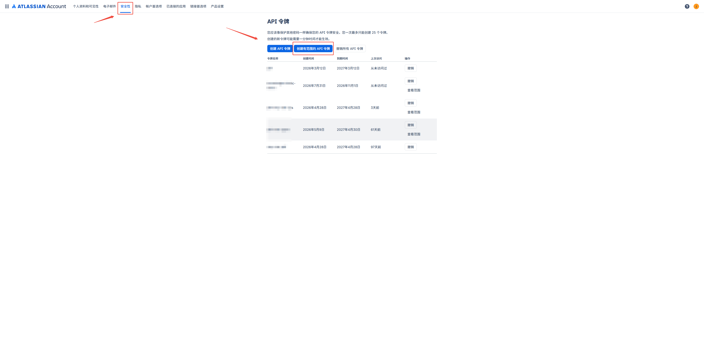
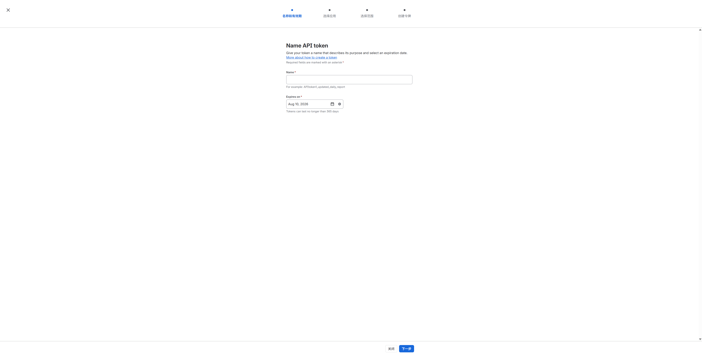
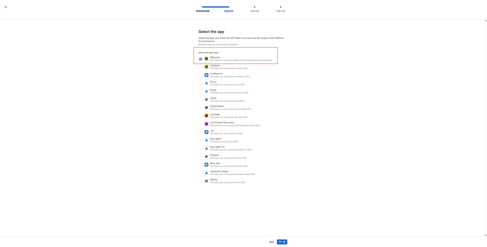
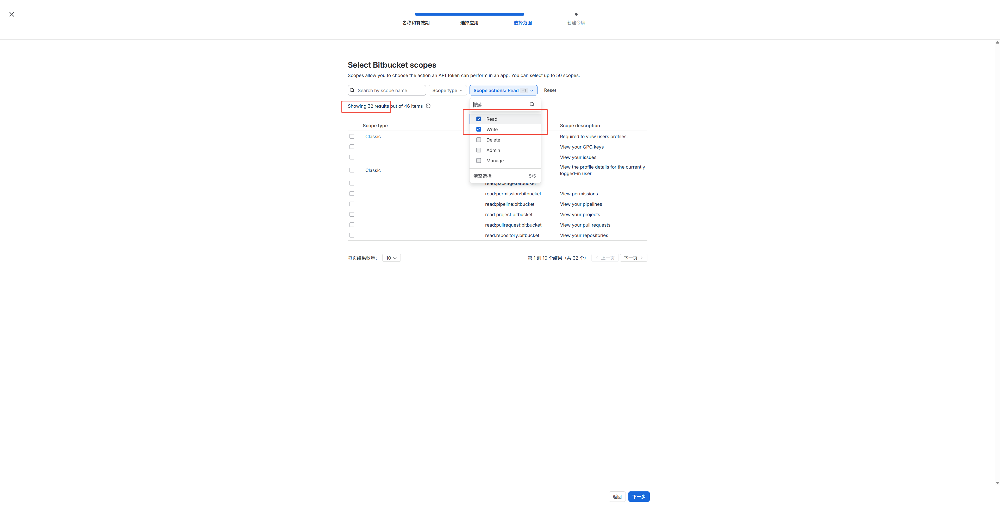
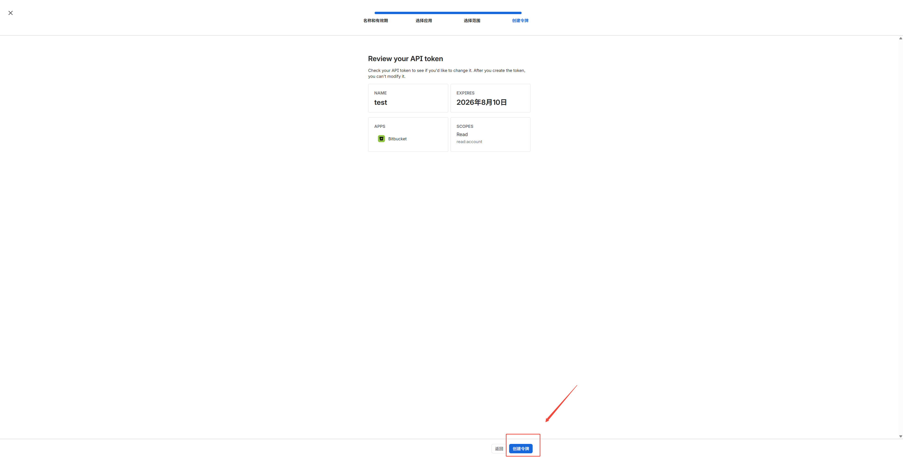

# 配置 Bitbucket Cloud 凭证

本指南说明如何创建 Atlassian API token，并将它连接到 Knowledge Fabric 的资源库。连接后，系统会列出你有权限访问的 Bitbucket 代码仓库和分支，并在导入时使用该 token 执行 Git 操作。

## 开始前

- 使用拥有目标仓库访问权限的 Atlassian 账号。
- API token 只会在创建完成时完整显示一次；请立即复制并妥善保管。
- 不要把 token 发到聊天、邮件、工单或提交到 Git 仓库。如果怀疑泄露，请到 Atlassian 撤销该 token 并重新创建。

## 1. 打开 API token 页面

访问 [Atlassian API token 管理页](https://id.atlassian.com/manage-profile/security/api-tokens)，在“安全”页选择“创建有范围的 API 令牌（Create scoped API token）”。

## 2. 填写名称和有效期

为 token 填写便于识别的名称，例如 `knowledge-fabric-bitbucket`，并设置适合团队安全策略的到期时间。到期后需要重新创建并在系统中更新 token。

## 3. 选择 Bitbucket 应用

在“Select the app”中选择 **Bitbucket**，然后点击“下一步”。

## 4. 选择权限范围

按需要勾选 Bitbucket 的权限范围：

- 导入、浏览仓库和分支至少需要仓库读取权限，以及能读取当前账号信息的权限。
- 如果后续需要通过 Git 或 Bitbucket API 写入仓库、创建分支或 Pull Request，也需要选择对应的写入权限。

截图展示了在权限动作筛选中选择 **Read** 和 **Write** 的方式。系统不会额外缩减 token 的 Git 操作能力；最终可执行的远端读写操作以 Bitbucket 为该 token 授予的权限为准。

## 5. 确认并创建 token

核对名称、有效期、应用和权限范围后，点击“创建令牌（Create token）”。随后立即复制页面展示的 token。

## 6. 连接到 Knowledge Fabric

1. 打开 **资源库**，进入 **关联服务**。
2. 选择 **连接 Bitbucket Cloud**。
3. 输入该 Atlassian 账号的邮箱和刚复制的 API token。
4. 点击 **验证并保存**。出现“已连接：你的邮箱”即表示连接成功。
5. 点击 **从 Bitbucket 导入**，选择代码仓库与默认分支，再点击导入。

导入过程中会拉取所选默认分支，仓库较大时请等待导入完成。成功后资源库列表会自动刷新。

## 常见问题

### 无法列出仓库或分支

确认 token 仍有效、选择了 Bitbucket 应用，并包含所需读取权限；同时确认你的 Atlassian 账号本身具有目标 workspace 和仓库的访问权限。

### Git 提示认证失败或无权访问仓库

先确认账号能在浏览器中访问该仓库。若可以访问，重新保存 token 后重试；仍失败时，检查 token 的仓库读取权限和有效期。

### token 已泄露或不再使用

在 Atlassian API token 管理页撤销它，再创建新 token，并在 Knowledge Fabric 中重新“验证并保存”。
